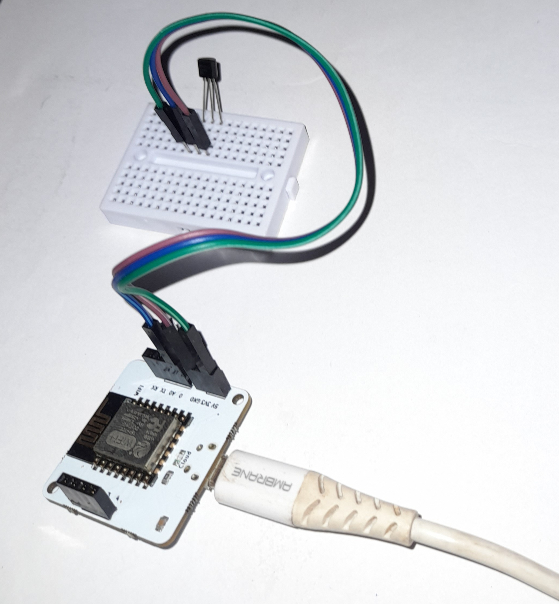

# Temperature Monitoring and Alarm System

## Overview

This project aims to address the issues related to poor handling and storage facilities in blood banks, pharmaceutical industries, and server rooms in India. It provides a real-time temperature monitoring and alert system using the Bolt IoT platform, LM35 temperature sensor, and third-party services like Twilio and Mai

## Motivation

1. In India, more than 6 lakhs liters of blood gets discarded due to poor handling and unattended storage facilities in blood banks.
2. Pharmaceutical industries suffer huge losses due to poor monitoring of products.
3. Data loss and machine damage occur across server rooms due to inadequate monitoring.

Traditional data loggers and chart recorders do not offer real-time visibility and alerts.

## Hardware Components

- Bolt WiFi module
- LM35 temperature sensor
- 3 male-to-male wires
- Breadboard

## Sensor Details

**LM35 Temperature Sensor**
- A linear temperature sensor whose output voltage changes linearly with the change in temperature.
- It can measure temperature from -55°C to 155°C.

## Software Components

### Twilio

Twilio is a third-party SMS functionality provider. It allows software developers to programmatically make and receive phone calls and send and receive text messages using its web service APIs.

### Mailgun

Mailgun is an email automation service. It has a powerful set of inbuilt functions for sending emails. Developers can process their emails with the help of Mailgun API.

## Project Configuration

### Sensitive Information Setup

Make sure to set up your Twilio and Mailgun credentials in the project configuration files. This setup is required for sending SMS and email alerts.

## System Workflow

### Overview of Temperature Monitoring System

1. **Hardware Setup**: Connect the LM35 sensor to the Bolt WiFi module using a breadboard and male-to-male wires.
2. **Data Reading**: The system continuously reads temperature data from the LM35 sensor.
3. **Alert Configuration**: Compute bounds for temperature alerts based on the acceptable temperature range.
4. **Alert Triggering**: When the temperature goes out of the configured bounds, the system triggers alerts.
5. **Notification**: Alerts are sent via SMS using Twilio and via email using Mailgun.

### Computing Bounds for Temperature Alerts

Define the upper and lower bounds for temperature. The system will trigger alerts if the temperature goes beyond these bounds.

### Main Loop

The main loop involves reading sensor data and triggering alerts if necessary. It also updates the history of temperature readings.

### Sending Alerts and Updating History

Use Twilio to send SMS alerts and Mailgun to send email alerts. Update the history of readings and alerts for monitoring purposes.

## Thank You

